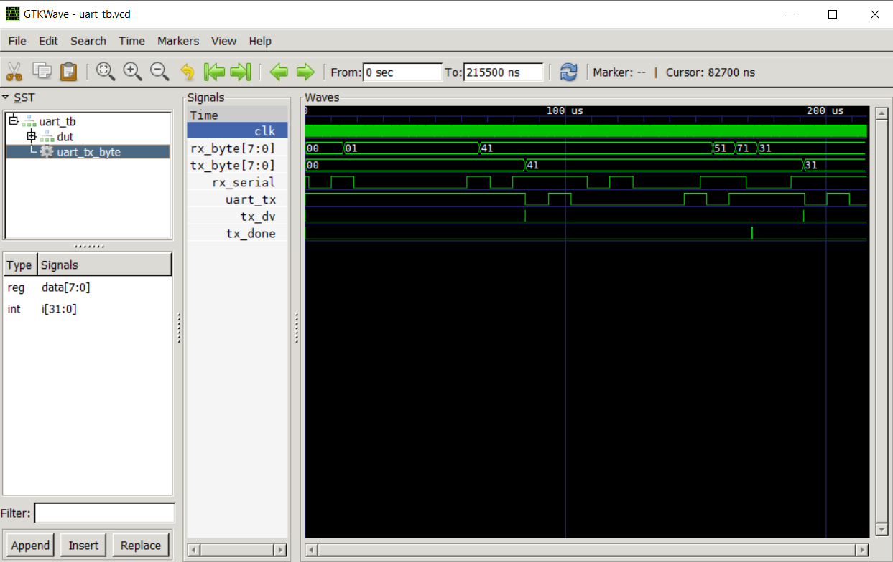

# **UART Echo Projesi (FPGA)**

---

## 📖 Proje Tanımı

Bu proje, FPGA üzerinde **UART tabanlı Echo uygulaması** gerçekleştirmektedir.  
Amaç, FPGA’ya UART üzerinden gelen her byte’ın aynı şekilde FPGA tarafından tekrar PC’ye gönderilmesidir.  
Böylece terminal programı (Putty, TeraTerm vb.) üzerinden gönderilen her karakter geri yansıtılır.  

Bu uygulama, **FPGA üzerinde UART haberleşmesi** için temel bir örnek olup daha gelişmiş UART tabanlı protokoller (örneğin hesap makinesi, sensör arayüzleri, veri kayıt sistemleri) için temel yapı taşıdır.  

---

## 🎯 Öğrenme Hedefleri

- UART haberleşme protokolünü anlamak (start/stop bitleri, baud rate).
- FPGA üzerinde **receiver (RX)** ve **transmitter (TX)** modüllerini kullanabilmek.
- Donanım Tanımlama Dili (Verilog) ile basit **FSM (Finite State Machine)** tasarımı yapmak.
- Donanım üzerinde simülasyon, sentez ve test süreçlerini deneyimlemek.
- FPGA ↔ PC haberleşmesini UART üzerinden doğrulamak.

---

## ⚙️ Algoritma

UART Echo uygulamasının işleyişi aşağıdaki adımlardan oluşur:

1. **Receiver (RX)** modülü, UART’dan gelen seri veriyi byte’a çevirir (`rx_byte`).
2. RX tamamlandığında (`rx_dv=1`) alınan byte FSM’e iletilir.
3. FSM bu byte’ı transmitter tarafına yükler (`tx_byte`).
4. Transmitter (`tx_dv=1`) veriyi tekrar seri hale getirerek UART TX pininden gönderir.
5. Gönderim tamamlandığında (`tx_done=1`) FSM tekrar bekleme durumuna döner.
6. Döngü sürekli devam eder → her alınan byte tekrar gönderilir (**echo**).

---

## 📂 Proje Klasör Yapısı

UART-Echo/  
│── src/ # Kaynak kodlar (.v)  
│ ├── uart.v # Top module (echo FSM)  
│ ├── uart.ccf # Pin atama dosyaları (echo FSM) 
│ ├── receiver.v # UART Receiver (RX)  
│ ├── transmitter.v # UART Transmitter (TX)  
│── sim/ # Simülasyon dosyaları  
│ ├── uart_tb.v # Testbench  
│── log/ # Simülasyon çıktı dosyaları  
│── Makefile # Build ayarları (opsiyonel)

---

## 📐 Sistem Blok Diyagramı

	

![[Images/UART_Schema.drawio.html]]

---

## 🔌 Donanım Bağlantısı

FPGA ↔ FT2232 ↔ PC bağlantısı şu şekildedir:

PC (Putty) <--> FT2232 (USB-UART) <--> FPGA (RX/TX)

- Baudrate: **115200 baud, 8N1**
- FPGA Clock: **10 MHz**
- TX/RX seviyeleri: **2.5V–3.3V uyumlu olmalı**

---

## 📐 Pin Atamaları (.ccf)

// Clock input (e.g., 10 MHz from onboard oscillator)
Net "clk"         Loc = "IO_SB_A8";      # Clock pin

// Reset input (aktif düşük, eğer harici buton bağlıysa)
NET "rst_n"     LOC = "IO_EB_A0";    # Reset butonu (opsiyonel)

// Push-button input (SW3)
NET "button"    LOC = "IO_EB_B0";    # Active-low push button

// UART TX output
NET "rx_serial"   LOC = "IO_NB_A0";    # UART TX → FT2232 RX

// UART TX output
NET "uart_tx"   LOC = "IO_NB_A3";    # UART TX → FT2232 RX

// 8-bit active-low LED outputs
Net "led_out[0]"  Loc = "IO_EB_B1";      # D1
Net "led_out[1]"  Loc = "IO_EB_B2";      # D2
Net "led_out[2]"  Loc = "IO_EB_B3";      # D3
Net "led_out[3]"  Loc = "IO_EB_B4";      # D4
Net "led_out[4]"  Loc = "IO_EB_B5";      # D5
Net "led_out[5]"  Loc = "IO_EB_B6";      # D6
Net "led_out[6]"  Loc = "IO_EB_B7";      # D7
Net "led_out[7]"  Loc = "IO_EB_B8";      # D8

--- 

always @(posedge clk or negedge rst_n) begin
    if (!rst_n) begin
        tx_dv   <= 0;
        tx_byte <= 8'h00;
        state   <= 0;
    end else begin
        case (state)
            0: begin
                tx_dv <= 0;
                if (rx_dv) begin
                    tx_byte <= rx_byte; // gelen byte'ı geri gönder
                    tx_dv   <= 1;
                    state   <= 1;
                end
            end
            1: begin
                tx_dv <= 0;
                if (tx_done)
                    state <= 0;
            end
        endcase
    end
end

Bu FSM sayesinde **alınan her byte tek seferlik geri gönderilir**.

## 🧪 Simülasyon

Testbench: 

 
<a href="Uart/sim/iverilog/uart_tb.v">
<em style="display:flex;justify-content:center">uart_tb kod görüntüsü</em>
</a>	

- 10 MHz clock (100 ns period) oluşturulur.
- UART RX hattına `"A"` ve `"1"` karakterleri gönderilir.
- FPGA her karakteri geri gönderir.

### Beklenen Çıktı:

- RX’den `"A"` geldi → TX’den `"A"` gitti
- RX’den `"1"` geldi → TX’den `"1"` gitti

📷 **GTKWAVE Görüntüsü**  

	

---

## 🖥️ Donanım Testi (Putty)

- **Baudrate**: 115200
- **Bağlantı**: FT2232 USB-UART → FPGA RX/TX

	

### Örnek Test:

- Terminalden `"FPGA"` yazılır → aynı `"FPGA"` geri gelir.
- Herhangi bir karakter veya string gönderildiğinde **echo** edilir.
    

📷 **Putty Ekran Görüntüsü**  

	

---

📷 **FPGA Kartı Fotoğrafı**  

	

      

---

## ✅ Sonuç ve Değerlendirme

Bu proje ile:

- FPGA üzerinde **UART haberleşmesi** başarıyla gerçekleştirildi.
- Gelen her byte FPGA üzerinden geri gönderilerek **UART Echo** fonksiyonu sağlandı.
- Donanım üzerinde testler (Putty terminal) başarıyla doğrulandı.
- Proje, daha karmaşık UART tabanlı uygulamalar (hesap makinesi, veri protokolleri, sensör haberleşmesi) için bir **altyapı** sunmaktadır.

