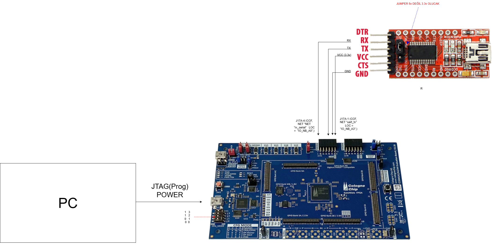

# **UART Calculator**

### 🎯 Objective

This project implements a simple **UART-based calculator** on an FPGA.

The user sends two numbers and an operation symbol via a terminal (e.g., PuTTY) in the format:

`a + b =`

The FPGA receives this data, performs the **addition operation**, and transmits the result back via UART.

**Example:** `46+12= ---> FPGA ---> 58`

---

### ⚙️ Algorithm

1. **UART RX** The serial data from the PC is converted into 8-bit ASCII bytes using the `receiver` module (`rx_byte`, `rx_dv`).
    
2. **FSM (Finite State Machine)** * Number 1 is read (e.g., `46` → stored into `a_val`).
    
    - Upon receiving the `+` character, the system switches to the second number.
        
    - Number 2 is read (e.g., `12` → stored into `b_val`).
        
    - When the `=` character is received, `sum = a_val + b_val` is calculated.
        
3. **UART TX** The resulting sum is **split into ASCII characters** and sent back to the PC using the `transmitter` module.
    
    - Single-digit result → `"5"`
        
    - Two-digit result → `"58"`
        

---

### 📂 Project Structure

Plaintext

```
UART_Calculator/
│── src/                  # Source codes
│   ├── uart_calculator.v
│   ├── receiver.v
│   ├── transmitter.v
│── sim/                  # Simulation files
│   ├── uart_calculator_tb.v
│── doc/                  # Documentation, images
│── Makefile / .do file   # (optional) simulation/build settings
```

---

### 🔧 Hardware Connection (Constraint File)

<p align="center">  </p>

<p align="center">  </p>

 <a href="Uart-Calculator/src/uart_hesap_makinesi.ccf"> <em style="display:flex;justify-content:center">uart_calculator.ccf</em> </a>

⚠️ When connecting via FT232H, do not forget to cross-connect TX ↔ RX.

---

### 🧪 Testbench

The project can be simulated using the provided **testbench**:

<p align="center"> <a href="Uart-Calculator/sim/iverilog/uart_hesap_makinesi_tb.v"> <em style="display:flex;justify-content:center">uart_calculator_tb.v</em> </a> </p>

**String to be sent:** `"46+12="`

Verilog

```
uart_send_byte("4");
uart_send_byte("6");
uart_send_byte("+");
uart_send_byte("1");
uart_send_byte("2");
uart_send_byte("=");
```

**Expected Output:** `58`

📊 **Signals to monitor in simulation:** * `rx_serial` → UART input from PC

- `rx_byte` → Received ASCII character
    
- `a_val`, `b_val`, `sum` → Numerical values
    
- `uart_tx` → UART data sent back from FPGA
    
- `tx_byte`, `tx_dv`, `tx_done`
    

---

### 🖥️ Terminal Test (PuTTY / YAT)

1. Connect the FPGA to the PC (USB–UART).
    
2. Terminal program settings:
    
    - **115200 baud**
        
3. Example:
    
    `Input → 46+12= Output → 58`
    

<p align="center">  </p>

---

### ✅ Conclusion

A **simple calculator that adds integers** over UART was successfully implemented on the FPGA. This project serves as an educational application for UART communication, FSM design, and ASCII ↔ decimal conversions.

Would you like me to translate another file or assist you with expanding the calculator to support other operations like subtraction or multiplication?