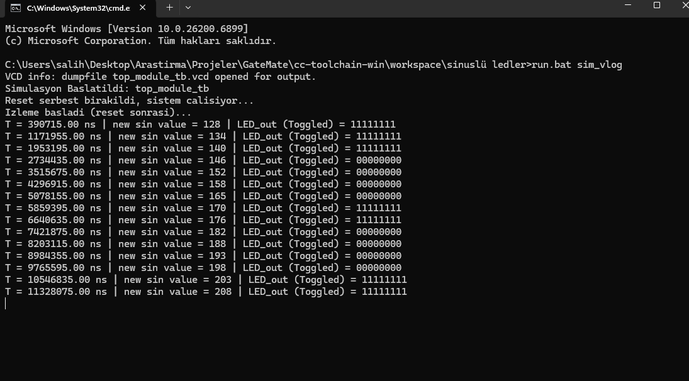
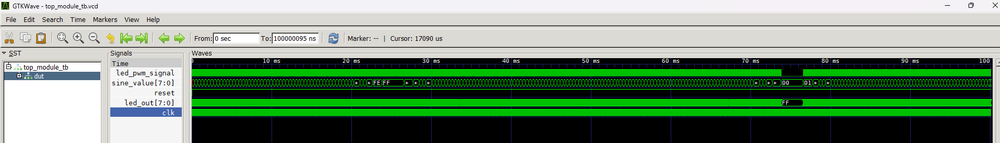
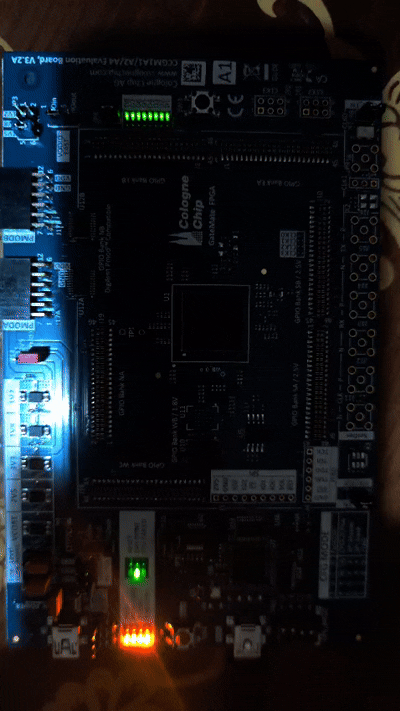

# ⚡ FPGA Sinüs Dalgası PWM - "Nefes Alan" LED Efekti

## 🎯 Proje Tanımı

Bu proje, FPGA üzerinde **PWM (Pulse Width Modulation)** tekniğini kullanarak LED parlaklığını bir **sinüs dalgasına** göre değiştirir.  
Böylece LED'ler yumuşak bir şekilde **nefes alma (breathing)** efektiyle yanıp söner.

- `sine_gen.v`: Sinüs dalgası üretimi (LUT tabanlı)
- `pwm_driver.v`: PWM sinyali üretimi
- `top_module.v`: Tüm sistemi birleştiren üst modül

---

## 🧠 Temel Amaçlar

- Verilog kullanarak 8-bit çözünürlüklü dijital bir **sinüs dalgası üreteci** tasarlamak.  
- Bu değeri kullanarak **LED parlaklığını PWM duty cycle** üzerinden kontrol etmek.  
- Yaklaşık **10 Hz frekansında** nefes alma efekti oluşturmak.  
- Tüm LED’leri senkronize çalıştırarak akıcı bir görsel efekt sağlamak.

---

## ⚙️ Sistem Mimarisi

  

### 🟦 1. Sinüs Dalgası Üretimi 
`
<a href="sinuslü ledler/src/sine_gen.v"><em> sine_gen.v</em> </a>
`

- 100 MHz sistem saatinden 10 Hz frekansında bir sinüs çıkışı elde etmek için **saat bölücü** kullanılır.  
- 256 adımlı **Look-Up Table (LUT)** içindeki sinüs değerleri sırayla okunur.  
- Her adımda `lut_index` artar ve `sine_out` çıkışı 0–255 arasında bir değer üretir.

**Basit akış:**
clk → clk_divider → lut_index++ → sine_lut[lut_index] → sine_out (8-bit)

---

### 🟨 2. PWM Üretimi

<a href="sinuslü ledler/src/pwm_driver.v"><em> pwm_driver.v</em> </a>

- `sine_out` değeri, PWM sinyalinin **duty cycle** değeri olarak kullanılır.  
- 8-bitlik bir `pwm_counter` sürekli olarak 0–255 arasında sayar.  
- Karşılaştırma yapılır:
  - Eğer `pwm_counter < sine_val` → `led_pwm_out = 1`
  - Aksi durumda → `led_pwm_out = 0`

Sonuç olarak, **yüksek sinüs değerinde LED daha parlak**, düşük değerinde ise daha sönüktür.

---

### 🟩 3. Üst Seviye Bağlantı

<a href="sinuslü ledler/src/top_module.v"><em> top_module.v</em> </a>

- `sine_gen` ve `pwm_driver` modüllerini bağlar.
- Tek bitlik PWM çıkışı, `{8{led_pwm_signal}}` ifadesiyle 8 LED'e kopyalanır.
- FPGA kartında LED’ler **aktif-düşük (active-low)** olduğu için sinyal terslenir (`~` operatörü ile).

**Çıkış:**
led_out = ~{8{led_pwm_signal}};

yaml
Kodu kopyala

---

## 🔄 Çalışma Akışı

1. FPGA başlatıldığında `reset = 0` → tüm sayaçlar sıfırlanır.  
2. `reset = 1` olduğunda `clk_divider` ve `pwm_counter` çalışmaya başlar.  
3. Sinüs dalgası LUT üzerinden sürekli olarak taranır.  
4. PWM duty cycle sinüs değerine göre değişir.  
5. 8 LED senkronize şekilde **nefes alma efekti** gösterir (~10 Hz).

---

## 📂 Proje Dosya Yapısı

FPGA_Sine_PWM/
│
├── hdl/ # Verilog kaynak kodları
│ ├── top_module.v # Ana (Top) modül
│ ├── sine_gen.v # Sinüs dalgası üretici modül
│ ├── pwm_driver.v # PWM sürücü modülü
│ └── pwm_gen.v # Debug amaçlı modül (ILA içerir)
│
├── constraints/
│ └── top_module.ccf # FPGA pin tanımlamaları
│
└── sim/
└── tb_top_module.v # Testbench (simülasyon dosyası)

yaml
Kodu kopyala

---

## 🔧 Donanım Bilgileri

- **FPGA Geliştirme Kartı:** GateMate ccgm1a1 EvaBoard V3.2A  
- **Sistem Saati:** 10 MHz  
- **PWM Çözünürlüğü:** 8-bit  
- **Sinüs LUT Boyutu:** 256 nokta  
- **Sinüs Frekansı:** ~10 Hz  
- **LED Sayısı:** 8 (aktif-düşük)

---

## 🚀 Gözlem

Program FPGA’ya yüklendiğinde:
- Reset bırakıldığında (`reset = 1`), sistem çalışmaya başlar.  
- Tüm LED’ler aynı anda, yumuşak geçişli şekilde **parlaklığı artıp azalır.**

Gözlemlenen efekt, bir sinüs dalgasını **PWM parlaklığına** dönüştürerek oluşturulmuştur.

---

##  Test Görselleri

---

## Demo Görselleri

---
## 💬 Özet

Bu proje, FPGA üzerinde **sayısal sinüs dalgası üretimi** ve **PWM tabanlı analog benzeri kontrol** prensiplerini birleştirir.  
Sonuçta elde edilen nefes alan LED efekti, hem **PWM temellerini** hem de **dijital dalga sentezini** gösteren ideal bir FPGA başlangıç projesidir.

---

### 👤 Hazırlayan

**Salih Tekin Ayvacı**  
Electrical & Electronics Engineer  
