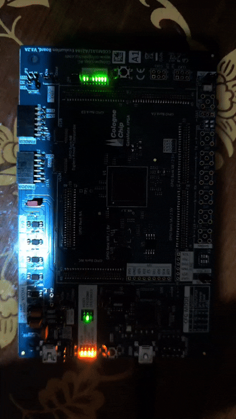

# ⚡ FPGA Sine Wave PWM - Phase-Shifted "Chasing Light" Effect

### 🎓 **Hardware Sine PWM Experience with Verilog**

---

## 🎯 Project Summary

This project creates a **"wave/chase" light effect** across 8 LEDs using **sine-based PWM control on an FPGA**.

The brightness of each LED is derived from a 256-step **Sine Look-Up Table (LUT)**. Thanks to a **sine frequency of approximately 10 Hz** generated from a 100 MHz system clock, the LEDs fade in and out smoothly according to a sine wave. Since each LED progresses with a 32-step phase difference, a **light effect that flows like a wave** is created within the system.

---

## 🧠 Project Objectives

✅ Design an 8-bit resolution **Sine LUT** using Verilog

✅ Generate a **slow index (~10 Hz)** from a 100 MHz system clock

✅ Apply a **phase shift (PHASE_SHIFT = 32)** for 8 LEDs

✅ Control the brightness of each LED via **PWM duty cycle**

✅ Create a **fluid, synchronized light wave** on the FPGA

---

## ⚙️ System Architecture

### 🟦 1. Main Index Generator

<a href="sinüslü kayan ledler/src/sine_gen_index.v"><em>sine_gen_index.v</em></a>

- Receives the 100 MHz clock signal.
    
- Creates a counter at approximately **10 Hz** using a `CLK_DIVIDER_MAX = 39061` value.
    
- Produces a `master_index` output between 0 – 255.
    
- This output serves as the base for LUT addressing.
    

📈 **Timing:**

`clk (100 MHz) └──► clk_divider (0→39061) └──► lut_index++ → master_index (0–255, 10 Hz)`

---

### 🟨 2. PWM Generator and Phase Shifting

<a href="sinüslü kayan ledler/src/pwm_gen.v"><em>pwm_gen.v</em></a>

#### 🔹 Sine LUT

A LUT containing 256 points with 8-bit amplitude values (ranging from 0–255).

#### 🔹 PWM Counter

Counts from 0–255 with the 100 MHz clock. This counter determines the frequency of the PWM signal (~390 kHz).

#### 🔹 Phase Shifting

The LUT index for each LED is calculated as follows:

index_i = master_index + (i * PHASE_SHIFT)

Phase difference = 32 steps.

#### 🔹 PWM Comparison

`if (pwm_counter < sine_value[i]) LED[i] = 1; else LED[i] = 0;`

#### 🔹 Output Inverter

Since the LEDs are active-low:

assign led_pwm_out = ~led_pwm_out_reg;

---

## 🔄 Operation Flow

1. `reset` low → counters are zero.
    
2. `reset` high → the system starts operating.
    
3. While the `pwm_counter` counts rapidly, the `master_index` increments slowly.
    
4. The brightness of each LED changes according to the sine table.
    
5. Due to the phase difference, the LEDs follow one another.
    
6. Result: **A light effect that flows like a wave.**
    

---

## 🔧 Hardware Information

|**Component**|**Description**|
|---|---|
|**FPGA Board**|GateMate ccgm1a1 EvaBoard V3.2A _(example application)_|
|**System Clock**|10 MHz|
|**Reset**|Active-low (`IO_EB_B0`)|
|**Sine LUT Size**|256 samples|
|**PWM Frequency**|≈ 390 kHz|
|**Sine Frequency**|≈ 10 Hz|
|**PWM Resolution**|8-bit|
|**Number of LEDs**|8 (active-low)|
|**Phase Shift**|32 steps|

---

## 🎬 Visuals and Videos

---

## 🧪 Simulation Environment

- **Simulator:** Icarus Verilog / GTKWave
    
- Commands:
    
    iverilog -o sim_out src/*.v sim/tb_pwm_gen.v
    
    vvp sim_out
    
    gtkwave waveform.vcd
    

---

## 🧑‍🔧 Developer

**Salih Tekin Ayvacı** **DEMSAY ELEKTRONİK – R&D**