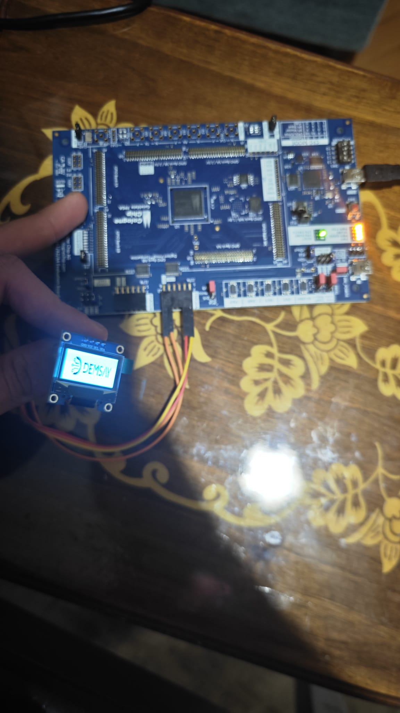
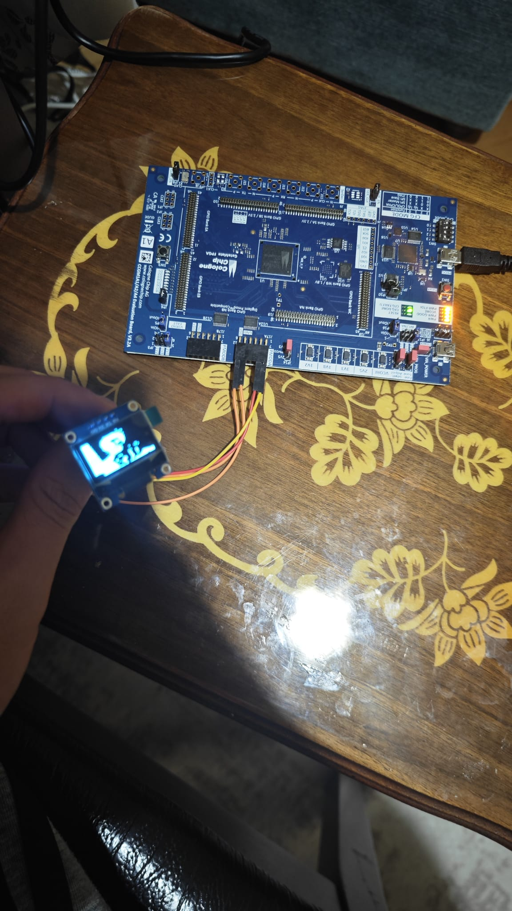

# **FPGA I2C OLED Görüntü Değiştirici (Image Toggle)**

##  **Görev Tanımı**
Bu proje, bir FPGA kullanarak 128x64 çözünürlüklü bir I2C OLED ekranı sürmeyi amaçlar. Proje, iki farklı görüntüyü FPGA'in dahili RAM bloklarında saklar. Harici bir buton kullanılarak bu iki görüntü arasında **"toggle" (geçiş)** işlemi yapılır.

Görüntüler, `png_to_hex.py` script'i ile 1024 byte'lık `.hex` dosyalarına dönüştürülür ve `Simple_RAM` modülleri tarafından sentez sırasında hafızaya yüklenir.

---

## 🎯 **Amaç**

- Verilog kullanarak bir **I2C Master kontrolcüsü**(<a href="Ssd1306-Oled-Control-With-I2C/src/I2C.v"><em> I2C.v</em> </a>) tasarlamak 
- **SSD1306** veya benzeri 128x64 I2C OLED ekranlar için bir **sürücü** (<a href="Ssd1306-Oled-Control-With-I2C/src/OLED.v"><em> OLED.v</em> </a>) geliştirmek  
- Görüntü verilerini FPGA üzerinde **Simple_RAM** modüllerinde depolamak (<a href="Ssd1306-Oled-Control-With-I2C/src/Simple_RAM.v"><em> Simple_RAM.v</em> </a>)
- **debounce_ip_core** kullanarak fiziksel buton gürültüsünü filtrelemek (<a href="Ssd1306-Oled-Control-With-I2C/src/debounce_ip_core.v"><em> debounce_ip_core.v</em> </a>)
- Buton girişi ile iki farklı RAM bloğu arasında seçim yaparak ekrandaki görüntüyü anında değiştirmek (<a href="Ssd1306-Oled-Control-With-I2C/src/Top_OLED.v"><em> Top_OLED.v</em> </a>)
- Görüntüleri (PNG, JPG) Verilog'un anlayacağı `.hex` formatına dönüştüren Python araçlarını sağlamak (<a href="Ssd1306-Oled-Control-With-I2C/tools/png_to_hex.py"><em> png_to_hex.py</em> </a>, (<a href="Ssd1306-Oled-Control-With-I2C/tools/hex_goruntule.py"><em> hex_goruntule.py</em> </a>)

---

## ⚙️ **Algoritma**

### 1️⃣ Başlatma (Initialization)

1. FPGA resetlenir (`reset_n = 0`).
2. `Simple_RAM` modülleri (`ram1` ve `ram2`) sentez aşamasında `image_data.hex` ve `image2.hex` dosyalarını kendi hafıza bloklarına yükler.
3. `Top_OLED` modülündeki `image_select` register'ı `0` olarak başlar, böylece `ram1` (ilk görüntü) seçili olur.
4. `OLED.v` kontrolcüsü, `step = 0`'dan `step = 24`'e kadar olan başlatma komutlarını I2C üzerinden ekrana gönderir (Örn: Display OFF, Set MUX Ratio, Set Charge Pump, Display ON).

---

### 2️⃣ Görüntü Yazma Döngüsü

1. Başlatma tamamlandığında (`step = 25`), `OLED.v` ana görüntü yazma döngüsüne girer.  
2. OLED kontrolcüsü, `page` (0–7) ve `col` (0–127) sayaçlarına göre ekranın imleç konumunu ayarlar.  
3. Kontrolcü, 0–1023 arasında bir `addr` (RAM adresi) üretir.  
4. Bu `addr`, `Top_OLED.v` modülündeki her iki RAM'e (`ram1`, `ram2`) aynı anda gönderilir.  
5. `Top_OLED.v` içerisindeki **MUX**, `image_select` bitine göre `ram1_dout` veya `ram2_dout` çıkışlarından birini seçer.  
6. Seçilen veri (`ram_mux_out`), `OLED.v` kontrolcüsüne `ram_dout` olarak girer.  
7. `OLED.v`, bu veriyi `I2C.v` modülünü kullanarak ekrana gönderir (`DCn = 1`).  
8. Bu işlem saniyede birçok kez tekrarlanarak görüntü ekranda sürekli olarak tazelenir.

---

### 3️⃣ Buton Tespiti ve Görüntü Değişimi

1. Kullanıcı fiziksel `button`'a bastığında, `debounce_ip_core` modülü sinyaldeki gürültüyü temizler.  
2. Butona basma anı (düşen kenar), `btn_valid = 1` ve `btn_stable = 0` olarak algılanır.  
3. Bu durum, `Top_OLED.v` içindeki `always` bloğunu tetikler ve `image_select` register'ının değeri terslenir (`image_select <= ~image_select`).  
4. `image_select` bitinin değişmesi, RAM MUX'unun kaynağını anında değiştirir (örnek: `ram1_dout` → `ram2_dout`).  
5. `OLED.v` kontrolcüsü döngüsüne devam ederken, bir sonraki kare tazelemede verileri artık diğer RAM'den çekmeye başlar ve ekrandaki görüntü değişir.

---

## 🔧 **Kullanım (Görüntü Hazırlama)**

Projenin çalışması için `image_data.hex` ve `image2.hex` dosyalarına ihtiyaç vardır.

1. **Görüntü Hazırlama:**  
   128x64 piksel boyutunda iki adet siyah-beyaz görüntü hazırlayın (örnek: `logo.png`, `test.png`).

2. **Hex'e Çevirme:**  
   `png_to_hex.py` script'ini kullanarak bu görüntüleri dönüştürün:
   ``bash
   # 1. Görüntü 1
   INPUT_IMAGE_NAME = "logo.png"
   OUTPUT_HEX_FILE = "image_data.hex"

   # 2. Görüntü 2
   INPUT_IMAGE_NAME = "test.png"
   OUTPUT_HEX_FILE = "image2.hex"
> 💡 _Script, 128x64 olmayan görüntüleri otomatik olarak yeniden boyutlandırır._

3. **Doğrulama (Opsiyonel):**  
    `hex_goruntule.py` script'i ile `.hex` dosyalarının doğru görünüp görünmediğini kontrol edebilirsiniz.
    
4. **Sentez:**  
    `image_data.hex` ve `image2.hex` dosyalarını FPGA projenize ekleyin ve sentezleyin.
    
5. **Çalıştırma:**
    
    - FPGA başlatıldığında `image_data.hex` (Görüntü 1) görünür.
        
    - Butona basıldığında ekran `image2.hex`’e geçer.
        
    - Her basışta iki görüntü arasında geçiş yapılır.
      
FPGA_OLED_Image_Toggle/
├── src/                  # Verilog kaynak kodları
│   ├── Top_OLED.v        # Ana (Top) modül
│   ├── OLED.v            # OLED 128x64 Sürücüsü
│   ├── I2C.v             # I2C Master Kontrolcüsü
│   ├── Simple_RAM.v      # Senkron RAM Bloğu
│   ├──debounce_ip_core.v # Buton Gürültü Filtresi
│   └── Top_OLED.ccf      # FPGA Pin atamaları
├── /
│   └── Top_OLED.ccf      # FPGA Pin atamaları
│
├── image_data.hex  # RAM Hafıza dosyaları
├── image2.hex
│
├── tools/                 # Yardımcı Python scriptleri
│   ├── png_to_hex.py
│   └── hex_goruntule.py
│
└── README.md

## 💡 **Kod Yapısı**

### 1. (<a href="Ssd1306-Oled-Control-With-I2C/src/Top_OLED.v"><em> Top_OLED.v</em> </a>)

- Projenin ana modülüdür.
    
- `debounce_ip_core`, iki adet `Simple_RAM` ve `OLED` kontrolcüsünü birbirine bağlar.
    
- Buton basıldığında `image_select` register'ını güncelleyen **toggle mantığını** içerir.
    
- İki RAM çıkışı arasında seçim yapan **MUX** yapısını barındırır.
    

---

### 2. <a href="Ssd1306-Oled-Control-With-I2C/src/OLED.v"><em> OLED.v</em> </a>

- Ekranın çekirdek kontrolcüsüdür.
    
- Başlangıçta OLED başlatma sekansını yürütür (`step 0–24`).
    
- `page` ve `col` sayaçlarını kullanarak ekranı satır satır yazar.
    
- RAM'den okunacak `addr`’i üretir.
    
- `I2C.v` modülünü kullanarak veriyi ekrana yollar.
    

---

### 3. (<a href="Ssd1306-Oled-Control-With-I2C/src/I2C.v"><em> I2C.v</em> </a>)

- FSM (Finite State Machine) tabanlı bir **I2C Master** sürücüsüdür.
    
- `start` sinyali ile tetiklenir.
    
- `DCn` bitine göre **Komut/Veri** modunda çalışır.
    
- `SCL` ve `SDA` pinleri üzerinden veriyi seri olarak gönderir.
    

---

### 4. <a href="Ssd1306-Oled-Control-With-I2C/src/Simple_RAM.v"><em> Simple_RAM.v</em> </a>

- Parametrik bir **senkron RAM** modülüdür.
    
- 10-bit adres ve 8-bit veri ile 1024x8 (1KB) yapıdadır.
    
- `$readmemh` ile `.hex` dosyalarını sentez aşamasında yükler.
    

---

### 5. <a href="Ssd1306-Oled-Control-With-I2C/src/debounce_ip_core.v"><em> debounce_ip_core.v</em> </a>

- Mekanik butonlardaki **zıplamayı (bounce)** önleyen bir filtre modülüdür.
    
- Butona basıldığında tek saat darbesi uzunluğunda bir `out_valid` sinyali üretir.
    

---

## 📸 **Gerçek Donanım Görselleri**

### FPGA - OLED bağlantısı ve ilk görüntü:

### Buton ile ikinci görüntüye geçiş:

![[ssd1306-2.jpg]]

![[ssd1306-1.jpg]]

## ⚡ **Özet Akış**

|Adım|İşlem|Kaynak|
|---|---|---|
|1|FPGA resetlenir. RAM'ler `.hex` dosyalarını yükler. `image_select = 0` olur.|`Simple_RAM.v`, `Top_OLED.v`|
|2|`OLED.v` modülü I2C üzerinden ekranı başlatır (Komutlar gönderilir).|`OLED.v`|
|3|`OLED.v` görüntü döngüsüne girer, `addr` (0–1023) üretir.|`OLED.v`|
|4|`Top_OLED.v` MUX'ı `ram1_dout` verisini seçer.|`Top_OLED.v`|
|5|Görüntü 1 ekrana çizilir.|`OLED.v`, `I2C.v`|
|6|Kullanıcı butona basar.|`Top_OLED.ccf`|
|7|`debounce_ip_core` temiz bir `btn_valid` sinyali üretir.|`debounce_ip_core.v`|
|8|`Top_OLED.v` `image_select` register'ını `1` yapar.|`Top_OLED.v`|
|9|`Top_OLED.v` MUX'ı artık `ram2_dout` verisini seçer.|`Top_OLED.v`|
|10|Görüntü 2 ekrana çizilir.|`OLED.v`|

---

📘 **Hazırlayan:**  **Salih Tekin Ayvacı**  
