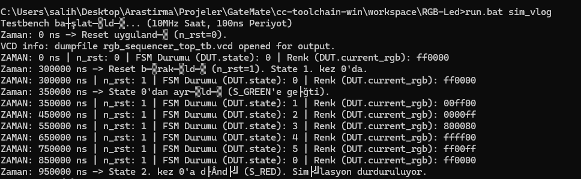
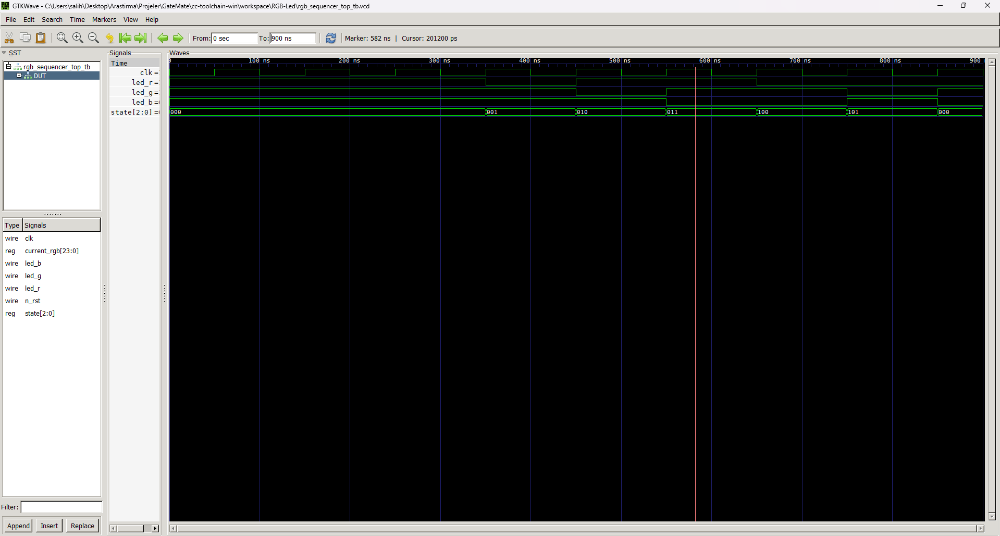
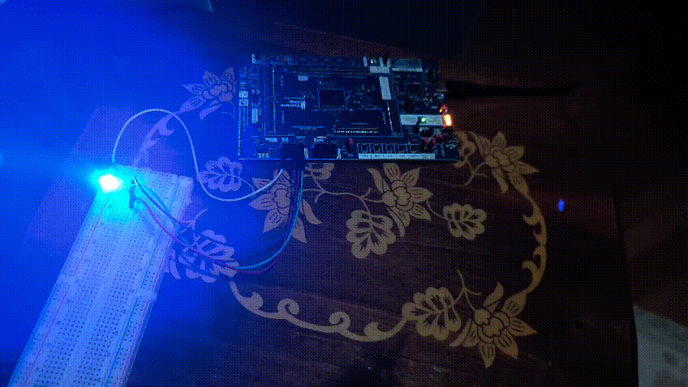

# **Verilog RGB LED Sequencer (FSM)**

**Task Description:** This project is an FSM (Finite State Machine) design running on an FPGA that sequentially lights up an RGB LED in 6 different predefined colors. The design consists of a top module named `rgb_sequencer_top.v` and a PWM (Pulse Width Modulation) sub-module named `RGBLed`.

---

## 🎯 **Features**

- Written in Verilog HDL.
    
- 6-State FSM (Red, Green, Blue, Purple, Yellow, Magenta).
    
- Adjustable state transition time (Default: 1 second).
    
- PWM-controlled LED driving via 24-bit color input using the `RGBLed` sub-module.
    
- Active-low reset (`n_rst`) support.
    

---

## 📂 **Project Structure**

Plaintext

```
RGB_LED_Sequencer/
├── RGBLed/
│   ├── src/                  # Verilog source codes
│   │   ├── rgb_sequencer_top.v # Main (Top) module
│   │   ├── RGBLed.v            # RGB PWM driver module
│   │   └── rgb_sequencer_top.ccf # FPGA pin definitions
│   └── sim/iverilog/
│       └── rgb_sequencer_top_tb.v # Testbench (simulation file)
├── Images/                   # Simulation and operational visuals
│   ├── iverilog-photo.png
│   ├── gtkwave.png
│   └── video.gif
└── README.md
```

---

## ⚙️ **Operation Logic**

The design is managed by an FSM within the `rgb_sequencer_top` module:

1. When a reset (`n_rst` = 0) is applied, the FSM enters the `S_RED` state and loads the `COLOR_RED` (24'hFF0000) value into the `current_rgb` register.
    
2. When the reset is released (`n_rst` = 1), the `timer_reg` counter begins incrementing on every clock pulse (`clk`).
    
3. When the counter reaches the `ONE_SECOND_COUNT - 1` value (9,999,999 for a 10MHz clock), the `timer_tick` signal pulses high ('1').
    
4. This `timer_tick` signal triggers the FSM to transition to the next state (e.g., `S_RED` -> `S_GREEN`) and updates `current_rgb` with the new color.
    
5. The cycle (Red -> Green -> Blue -> Purple -> Yellow -> Magenta -> Red) continues indefinitely.
    

---

## 🔧 **Configuration: Setting Transition Time to 1 Second**

The duration the project waits between colors is determined by a **single parameter** in the `rgb_sequencer_top.v` file:

Verilog

```
// --- Parameters (10MHz) ---
localparam CLK_FREQ_HZ      = 10_000_000; 
localparam ONE_SECOND_COUNT = CLK_FREQ_HZ; 
```

To ensure the transition time is exactly **1 second**, the `CLK_FREQ_HZ` parameter must **exactly match** the frequency of the clock signal entering your FPGA.

- **For 10 MHz Clock (Default):** `localparam CLK_FREQ_HZ = 10_000_000;`.
    
- **For 27 MHz Clock:** Change `CLK_FREQ_HZ` to `27_000_000`.
    

---

## 💡 **Code Structure**

### 1. <a href="RGBLed/src/rgb_sequencer_top.v"><em>rgb_sequencer_top.v</em></a>

- The main module containing the FSM logic and the 1-second timer.
    

<p align="center">  </p>

### 2. <a href="RGBLed/src/RGBLed.v"><em>RGBLed.v</em></a>

- The sub-module that receives the 24-bit RGB color code and converts it into PWM signals for the LEDs.
    

### 3. <a href="RGBLed/sim/iverilog/rgb_sequencer_top_tb.v"><em>rgb_sequencer_top_tb.v</em></a>

- The testbench file for the main module. It monitors the `state` of the FSM and automatically stops when the cycle returns to `S_RED` for the second time.
    

---

## 🧪 **Simulation and Waveforms**

The GTKWave simulation result below shows the `DUT.state` signal changing every 1,000,000,000 ns (1 second) with the 1-second configuration.

<p align="center"> 

  

<em style="display:flex;justify-content:center">Simulation Waveform</em> </p>

---

## 📸 **Hardware Visuals**

The image below shows the design running on the FPGA.

<p align="center"> 

  

<em style="display:flex;justify-content:center">FPGA RGB LED Operation</em> </p>

---

## 📌 **Pin Constraints (`.ccf`)**

The design has been tested with the following pin constraints:

Plaintext

```
# Clock input (10 MHz from onboard oscillator)
Net "clk"         LOC = "IO_SB_A8"; 

# Reset input (active low)
Net "n_rst"       LOC = "IO_EB_A0"; 

# RGB LED Outputs
Net "led_r"       LOC = "IO_NB_A5"; 
Net "led_g"       LOC = "IO_NB_A4"; 
Net "led_b"       LOC = "IO_NB_A6"; 
```

---

📘 **Prepared By:** **Salih Tekin Ayvacı**