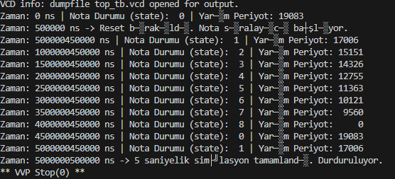
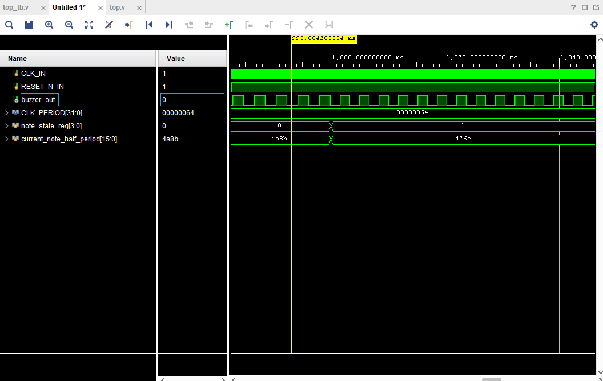

# **Verilog Note Sequencer**

This project is a Verilog design that sequentially plays a melody consisting of 8 notes (Do, Re, Mi, Fa, Sol, La, Si, Do) and a pause over a buzzer using a 10MHz system clock.

Each note and pause lasts for **1 second** before transitioning to the next. The total cycle duration is 9 seconds.

---

## **Features**

- **Dynamic Frequency Generation:** The `note_player.v` module generates a square wave frequency instantaneously based on a numerical input value representing the half-period duration.
    
- **Sequencer FSM:** The `top.v` module contains a 9-state Finite State Machine (FSM).
    
- **Adjustable Note Duration:** The `DURATION_LIMIT` parameter within `top.v` determines the duration of each note (currently set to 1 second).
    
- **Silence Support:** When a value of `0` is sent to the `note_player` module, it ensures silence by setting the `buzzer_out` output to '0'.
    

---

## **Module Hierarchy**

### **1. <a href="Buzzer_Test/src/Top.v"><em>Top.v</em></a> (Main Module):**

- Receives the system's 10MHz `CLK_IN` signal.
    
- Updates the `note_state_reg` state every 1 second (10,000,000 clock cycles).
    
- Selects the half-period value of the note to be played (`HP_C4`, `HP_D4`, etc.) based on the current state (`note_state_reg`).
    
- Transmits this value to the `note_player` module via the `current_note_half_period` signal.
    

### **2. <a href="Buzzer_Test/src/note_player.v"><em>note_player.v</em></a> (Frequency Generator):**

- Receives the `half_period_in` input from `top.v`.
    
- If `half_period_in == 0` (Pause), it sets `buzzer_out` to '0'.
    
- If `half_period_in > 0`, it counts from 0 to that value, toggles `buzzer_out`, and resets the counter. This process creates a square wave at the desired frequency on the `buzzer_out` pin.
    

---

## **Simulation in Vivado**

Simulating this project in Vivado is straightforward:

1. **Create a Vivado Project:** Open Vivado and create a new project.
    
2. **Add Design Sources:** Add `top.v` and `note_player.v`.
    
3. **Add Simulation Sources:** Add `top_tb.v`.
    
4. **Run Simulation:** Click **"Run Simulation" -> "Run Behavioral Simulation"** from the "Flow Navigator" panel.
    
5. **Simulation Window:** The simulator will run automatically for 10 seconds and then stop. To run it longer, modify the `#(10_000_000_000);` line in `top_tb.v` or remove the `$stop;` command.
    
6. **Examine Signals:**
    
    - Expand `top_tb` -> `DUT` (Design Under Test) in the "Scope" panel.
        
    - Drag the `note_state_reg` signal to the waveform window (Right-click the signal name and select "Radix -> Unsigned Decimal" to see decimal values).
        
    - Drag the `buzzer_out` signal to the waveform window.
        
    - Click the "Zoom Fit" button.
        
    - Observe the `note_state_reg` signal changing every 1 second (1,000,000,000 ns) in the sequence 0, 1, 2... 8, 0.
        
    - Zoom into the waveform to see the `buzzer_out` signal frequency change with each state. When the state is '8' (PAUSE), `buzzer_out` remains constant at '0'.
        

---

## **Visuals**

### **Simulation Form (Icarus)**

The waveform image showing the full 10-second cycle in the Vivado simulator. It demonstrates `note_state_reg` changing every 1 second and the `buzzer_out` frequency being adjusted accordingly.

<p align="center">  </p>

### **Simulation Waveform Image (Vivado)**

A photograph taken while the project is running on the FPGA board.

<p align="center">  </p>

---

## **Pin Constraints**

The pins specified in the `top.ccf` file can be used to upload the project to the FPGA:

Plaintext

```
# Clock input (10 MHz)
Net "CLK_IN"         Loc = "IO_SB_A8";

# Reset input (Button)
Net "RESET_N_IN"     Loc = "IO_EB_B0";

# Buzzer Output
Net "buzzer_out"     Loc = "IO_NB_A7";
```

---

## 👤 **Prepared By**

**Salih Tekin Ayvacı** Electrical & Electronics Engineer