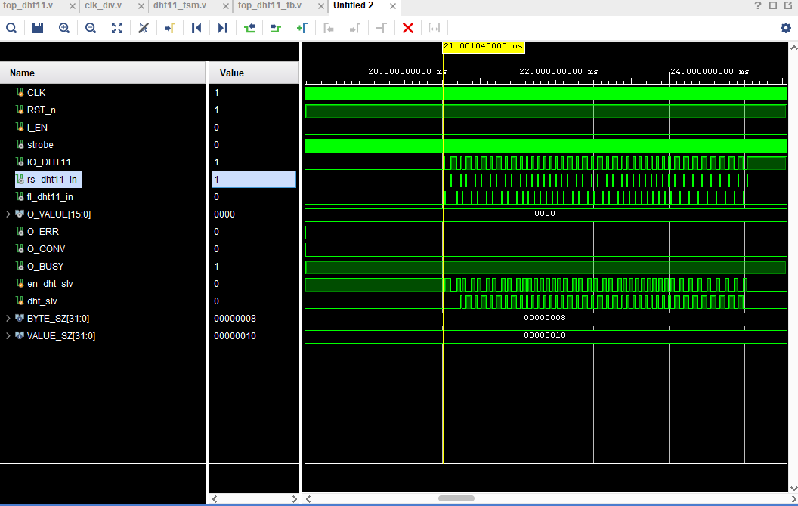
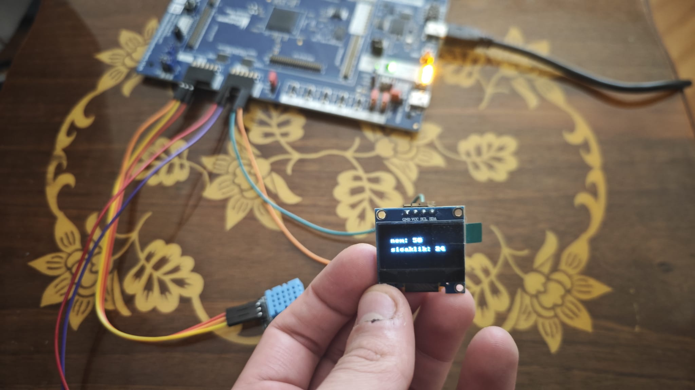

# **Displaying DHT11 Sensor Data on SSD1306 OLED with FPGA**

This project reads data from a **DHT11 temperature and humidity sensor** using an FPGA and displays this data on an **SSD1306 (128x64) OLED screen** via the I2C protocol.

The project takes the incoming 8-bit binary sensor data (e.g., 25°C), converts it into ASCII characters like "2" and "5," and prints them to the screen using an 8x8 font ROM. The display is configured to be rotated 180 degrees to compensate for physical mounting.

---

## **Project Architecture**

The project consists of several cores integrated under the `Sensor_Display_Top.v` module:

### **1. DHT11 Core (`top_dht11`)**

- **Clock Division:** Uses `clk_div` to divide the 10MHz main clock into a 1MHz (1µs) 'strobe' signal.
    
- **1-Wire Management:** The `dht11_fsm` uses this 1µs strobe to manage the 1-wire protocol, read 40-bit data from the sensor, and perform checksum verification.
    
- **Output:** When data is successfully read, it outputs the 16-bit `{Humidity[15:8], Temperature[7:0]}` data and sets the `O_CONV` signal to '1' for one clock cycle.
    

### **2. Screen Writing FSM (`Sensor_Display_Top`)**

- **Triggering:** Triggered by detecting the rising edge of the `O_CONV` signal.
    
- **Clearing:** First, it clears the entire `Frame_Buffer` (RAM) for a black screen.
    
- **Conversion:** Sends the `dht_value` data to `bin2ascii` modules to get ASCII codes for the tens and ones digits.
    
- **Font Processing:** Reads the relevant 8x8 font data from the `Font_ROM` for static text (e.g., "nem:", "sicaklik:") and dynamic ASCII characters from the sensor.
    
- **Writing:** In the `S_TRANSPOSE_WRITE` state, it rotates this font data 180 degrees and writes it to the `Frame_Buffer` (RAM).
    

### **3. OLED Driver (`OLED`)**

- **Independent Operation:** This module runs continuously, independent of the `Sensor_Display_Top` FSM.
    
- **Scanning:** It continuously scans the `Frame_Buffer` (RAM) from address 0 to 1023.
    
- **Transmission:** Every 8-bit (1 column) data point read is sent to the SSD1306 screen via the `I2C` module.
    
- **Refresh:** This continuous refresh ensures the image on the screen remains static.
    

---

## **Module Descriptions**

- <a href="DHT11-SSD1306/src/Sensor_Display_Top.v"><em>Sensor_Display_Top.v</em></a>: The main (top) module that integrates all modules and contains the screen writing FSM.
    
- <a href="DHT11-SSD1306/src/top_dht11.v"><em>top_dht11.v</em></a>: DHT11 sensor wrapper module combining `clk_div` and `dht11_fsm`.
    
- <a href="DHT11-SSD1306/src/dht11_fsm.v"><em>dht11_fsm.v</em></a>: Core state machine managing the DHT11 1-wire protocol and data reading.
    
- <a href="DHT11-SSD1306/src/clk_div.v"><em>clk_div.v</em></a>: Divides the input clock (CLK_FREQ_HZ) into the desired 'strobe' signal.
    
- <a href="DHT11-SSD1306/src/OLED.v"><em>OLED.v</em></a>: Driver that sends SSD1306 initialization commands and continuously transfers data from the `Frame_Buffer` to the screen.
    
- <a href="DHT11-SSD1306/src/I2C.v"><em>I2C.v</em></a>: Module used by `OLED.v` to handle I2C master communication.
    
- <a href="DHT11-SSD1306/src/Frame_Buffer.v"><em>Frame_Buffer.v</em></a> (`Simple_RAM`): 1024x8 (1KB) dual-port RAM where the screen image is held.
    
- <a href="DHT11-SSD1306/src/Font_ROM.v"><em>Font_ROM.v</em></a>: ROM containing 8x8 size ASCII character fonts.
    
- <a href="DHT11-SSD1306/src/bin2ascii.v"><em>bin2ascii.v</em></a>: Synthesis-friendly (non-division) module that converts 8-bit binary numbers to 2-digit ASCII.
    
- <a href="DHT11-SSD1306/src/debounce_ip_core.v"><em>debounce_ip_core.v</em></a>: (Optional) Anti-bounce module for button signals.
    
- <a href="DHT11-SSD1306/src/db_dht11.v"><em>db_dht11.v</em></a>: (Alternative Top) A simpler version showing data on LEDs instead of OLED.
    

---

## **Simulation and Testing**

### **Simulation (GTKWave)**

When the `dht11_fsm_tb.v` testbench is run, it shows the GTKWave waveform for the DHT11 sensor's 1-wire protocol simulation and the FSM response.

  

### **Hardware and Constraints**

Targeted for the **Cologne Chip GateMate CCGM1A1 V3.2A** FPGA board:

- **Pin Assignments:** Available in the <a href="DHT11-SSD1306/src/Sensor_Display_Top.ccf"><em>Sensor_Display_Top.ccf</em></a> file.
    
- **System Clock:** 10MHz.
    
- **OLED Pins:** `SCL` (IO_NB_A1), `SDA` (IO_NB_A0).
    
- **DHT11 Data Pin:** `IO_DHT11` (IO_NB_A7).
    

---

## **Implementation and Operation Visuals**

The visuals below show the design running on the FPGA. The screen displays "nem: xx" (humidity) and "sicaklik: xx" (temperature), reflecting real-time changes from the sensor.

 

  

<em>FPGA Working Photograph</em> 

 

  

<em>FPGA Working Video</em> 

