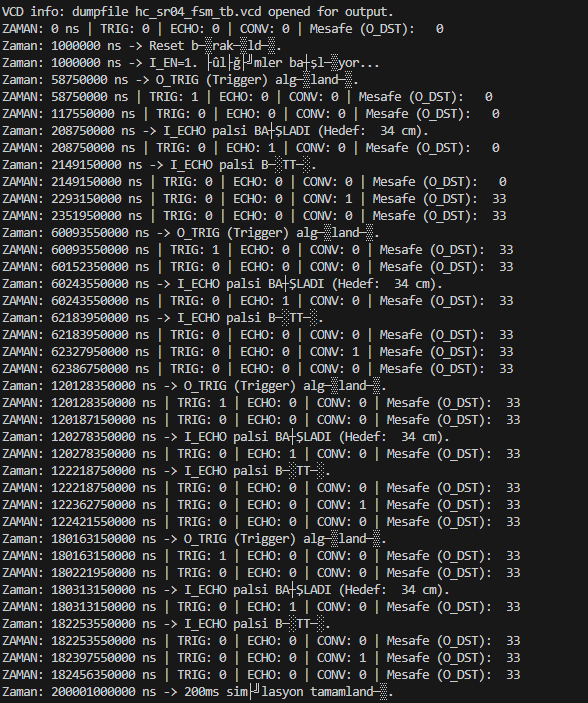

# Verilog HC-SR04 Mesafe Ölçer ve SSD1306 OLED Ekran

Bu proje, bir HC-SR04 ultrasonik mesafe sensörü kullanarak mesafeyi ölçen ve sonucu santimetre (cm) cinsinden 128x64 çözünürlüklü bir SSD1306 I2C OLED ekranda gösteren bir FPGA tasarımıdır.

Tasarım, mesafeyi "uzaklik: xxx (cm)" formatında, 8x8'lik bir font kullanarak ekrana yazar.

## 🚀 Özellikler

* **HC-SR04 Sensör Kontrolü:** `hc_sr04_fsm.v` modülü ile sensörün tetiklenmesi (trigger) ve yankı (echo) süresinin hassas ölçümü.
* **Saat Bölücü:** 10MHz'lik sistem saatini, sensör FSM'inin ihtiyaç duyduğu 58.8µs'lik tetikleme (strobe) sinyaline böler.
* **Binary -> BCD Çevirici:** `bcd_encoder.v` modülü, "Double Dabble" (Shift-and-add-3) algoritmasını kullanarak 9-bit'lik binary mesafe verisini 3 haneli BCD (Onlu) koda çevirir.
* **Frame Buffer Mimarisi:** 1KB (1024x8) boyutunda bir `Frame_Buffer.v` (Simple Dual-Port RAM) kullanır. Ana FSM (`Top_OLED.v`) bu RAM'e yazarken, `OLED.v` modülü bu RAM'den bağımsız olarak okuma yapar.
* **Font ROM:** `Font_ROM.v`, sentezleme sırasında `font8x8.hex` dosyasından yüklenen 8x8 piksel yazı tipi verilerini depolar.
* **SSD1306 OLED Sürücüsü:** `OLED.v` modülü, ekranı başlatan komutları gönderir ve ardından sürekli olarak Frame Buffer'daki veriyi ekrana çizer.
* **I2C Master:** `I2C.v` modülü, `OLED.v` için ~833kHz hızında çalışan, SSD1306'ya özel bir I2C iletişim çekirdeği sağlar.

## 🛠️ Modül Hiyerarşisi

* <a href="HCSR04-SSD1306/src/Top_OLED.v"><em> Top_OLED.v</em> </a>: Ana (Top) modül. Diğer tüm modülleri birbirine bağlayan ve ekran FSM'ini içeren ana tasarım dosyası.
* <a href="HCSR04-SSD1306/src/hc_sr04_fsm.v"><em> hc_sr04_fsm.v</em> </a>: HC-SR04 sensörünün zamanlamasını ve ölçümünü yöneten durum makinesi.
* <a href="HCSR04-SSD1306/src/clk_div.v"><em> clk_div.v</em> </a>: 10MHz saati 58.8µs periyoda bölerek `hc_sr04_fsm` için bir strobe (I_ST) sinyali üretir. 
* <a href="HCSR04/src/bcd_encoder.v"><em> bcd_encoder.v</em> </a>: 9-bit binary mesafeyi 3 haneli BCD'ye çevirir. 
* <a href="HCSR04-SSD1306/src/OLED.v"><em> OLED.v</em> </a>: Frame Buffer'dan sürekli okuma yaparak SSD1306 ekranı süren çekirdek.
* <a href="HCSR04-SSD1306/src/I2C.v"><em> I2C.v</em> </a>: `OLED.v` modülü tarafından kullanılan düşük seviyeli I2C Master.
* <a href="HCSR04-SSD1306/src/Frame_Buffer.v"><em> Frame_Buffer.v</em> </a>: 1024 byte (128x64 piksel) görüntü hafızası olarak kullanılan Çift Portlu RAM.
* <a href="HCSR04-SSD1306/src/Font_ROM.v"><em> Font_ROM.v</em> </a>: 8x8 piksel yazı tipi verilerini depolayan ROM.
* <a href="HCSR04-SSD1306/sim/iverilog/hc_sr04_fsm_tb.v"><em> hc_sr04_fsm_tb.v</em> </a>: (Simülasyon için testbench dosyası - bu projede yalnızca sensör çalışması için sağlandı.

## 🔄 Çalışma Mantığı

Tasarım, birbirinden bağımsız iki ana döngü üzerine kuruludur: **Ölçüm Döngüsü** ve **Ekran Döngüsü**.

### 1. Ölçüm Döngüsü (Veri Toplama)

Bu döngü, `Top_OLED` FSM'i tarafından yönetilir ve yaklaşık 60ms'de bir gerçekleşir:

1.  **Strobe Üretimi:** `clk_div` modülü, 10MHz'lik sistem saatini bölerek her 58.8µs'de bir `sensor_strobe` palsi üretir.
2.  **Mesafe Ölçümü:** `hc_sr04_fsm`, bu `sensor_strobe` sinyaliyle tetiklenir. Sensöre bir `trigger` palsi gönderir, gelen `echo` sinyalinin uzunluğunu sayar ve sonucu 9-bit'lik binary `sensor_dst` olarak çıkarır.
3.  **BCD Çevrimi:** Ölçüm bittiğinde, `hc_sr04_fsm` 1 clock'luk bir `sensor_conv` palsi üretir. Bu pals, `bcd_encoder` modülünü tetikler.
4.  **Dönüşüm:** `bcd_encoder`, 9-bitlik `sensor_dst` verisini alır, 3 haneli BCD'ye (`sensor_bcd_dst`) çevirir ve bu işlem sürerken `sensor_busy` sinyalini '1' yapar.
5.  **Veri Yazma (Top_OLED FSM):**
    * `Top_OLED` modülündeki ana FSM, `sensor_busy` sinyalinin '0'a düşmesini bekler (yeni veri hazır).
    * Hazır olduğunda, `sensor_bcd_dst` verisini bir register'a (`bcd_data_reg`) kaydeder.
    * FSM, "uzaklik: xxx (cm)" metnini oluşturan 17 karakterlik bir döngüye girer.
    * Sırası gelen sayısal karakterler için BCD register'ından okuma yapar (ör: `bcd_data_reg[11:8] + ASCII_0`).
    * Her karakter için `Font_ROM`'dan 8 adet 8-bit'lik satır verisini okur.
    * **Karakter Döndürme (Transposition):** Okunan 8x8'lik yatay font verisini, dikey 8-bit'lik sütunlara dönüştürür ve `Frame_Buffer` RAM'ine yazar.

### 2. Ekran Döngüsü (Sürekli Yenileme)

Bu döngü, `OLED.v` modülü tarafından **sürekli ve bağımsız** olarak çalıştırılır:

1.  **Başlatma:** Reset sonrası `OLED.v`, ekrana bir dizi I2C başlatma komutu gönderir (Ekranı aç, kontrastı ayarla, vb.).
2.  **Sürekli Okuma:** Başlatma sonrası `OLED.v` sonsuz bir döngüye girer. `Frame_Buffer`'ın 0. adresinden başlayarak 1023. adresine kadar tüm veriyi (1024 byte) sırayla okur.
3.  **I2C Gönderimi:** Okuduğu her bir byte'ı (`ram_dout`), `I2C.v` modülü aracılığıyla SSD1306'nın görüntü hafızasına gönderir.
4.  **Yenileme:** 1024 byte'ın tamamı gönderildiğinde, bir kare tamamlanmış olur. `OLED.v` modülü `FPS` (Frame Per Second) sinyalini `toggle` eder ve adresi sıfırlayarak döngüye yeniden başlar.

Bu mimari sayesinde, karmaşık metin yazma işlemi (Ölçüm Döngüsü) ekranın tazelenmesini (Ekran Döngüsü) kesinlikle durdurmaz veya yavaşlatmaz.

---

## 🔬 Simülasyon (Testbench)

*(Icarus Verilog ve GTKWave kullanılarak yapılan simülasyon görüntülerini buraya ekleyin)*

`tb_Top_OLED.v` testbench'i çalıştırıldığında...



Aşağıdaki dalga formu, `hc_sr04_fsm`'in `sensor_strobe` ile tetiklendiğini, `O_TRIG` palsi ürettiğini, `I_ECHO`'yu ölçtüğünü ve `O_CONV` palsi ile `bcd_encoder`'ı tetiklediğini göstermektedir.


## 📺 Uygulama ve Çalışma Görselleri

Tasarımın FPGA üzerinde çalışırken çekilmiş videosu. Ekranda "uzaklik: xxx (cm)" yazısı ve sensörün önündeki engele göre "xxx" değerinin değişimi görülmektedir.


## 📌 Pin Kısıtlamaları (Constraints)

Tasarım, `constraints/Top_OLED.ccf` dosyasındaki aşağıdaki pin kısıtlamaları ile test edilmiştir:

```verilog
# --- Sistem Pinleri ---
# Clock input (10 MHz from onboard oscillator)
Net "clk"         LOC = "IO_SB_A8";
# Reset input (aktif düşük)
Net "reset_n"     LOC = "IO_EB_A0";

# --- I2C OLED Bağlantıları ---
Net "SDA"         LOC = "IO_NB_A0";
Net "SCL"         LOC = "IO_NB_A1";
Net "FPS"         LOC = "IO_NB_B2";

# --- HC-SR04 Ultrasonik Sensör Pinleri ---
Net "trigger"     LOC = "IO_NB_A5";
Net "echo"        LOC = "IO_NB_A4";
```

---

## 👤 Hazırlayan

Salih Tekin Ayvacı
Electrical & Electronics Engineer
