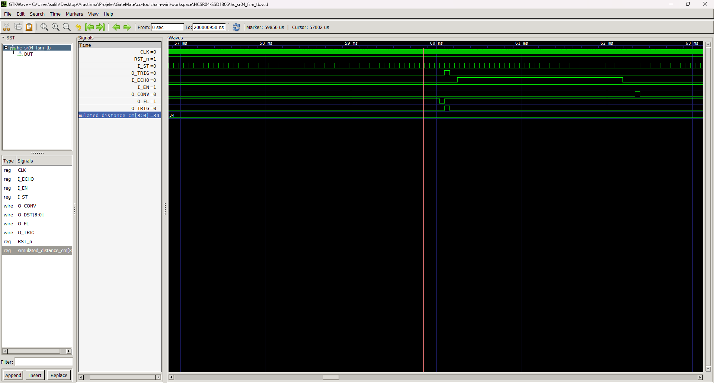
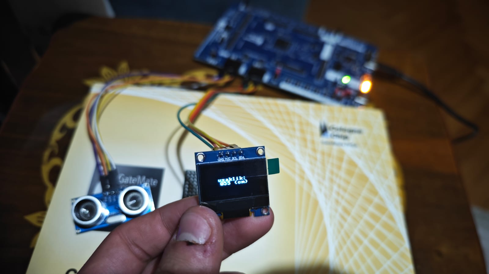

# **FPGA Distance Meter: HC-SR04 Sensor & SSD1306 OLED Display**

This project is an FPGA design that measures distance using an **HC-SR04 ultrasonic distance sensor** and displays the result in centimeters (cm) on a 128x64 resolution **SSD1306 I2C OLED display**. The system writes the distance to the screen in the format "uzaklik: xxx (cm)" using an 8x8 pixel font.

---

## 🎯 **Core Features**

- **HC-SR04 Sensor Control:** Precise measurement of trigger pulses and echo signal duration via the `hc_sr04_fsm.v` module.
    
- **Clock Divider:** Divides the 10MHz system clock into a 58.8µs strobe signal required by the sensor FSM.
    
- **Binary to BCD Converter:** Uses the "Double Dabble" (Shift-and-add-3) algorithm to convert 9-bit binary distance data into a 3-digit BCD (Decimal) code.
    
- **Frame Buffer Architecture:** Implements a 1KB (1024x8) `Frame_Buffer.v` (Simple Dual-Port RAM). The main FSM writes to this RAM while the `OLED.v` module reads from it independently.
    
- **Font ROM:** Stores 8x8 pixel typeface data loaded from `font8x8.hex`.
    
- **I2C Master:** A custom I2C core operating at ~833kHz specifically for the SSD1306.
    

---

## 🛠️ **Module Hierarchy**

- <a href="HCSR04-SSD1306/src/Top_OLED.v"><em>Top_OLED.v</em></a>: The top-level module connecting all components and housing the display FSM.
    
- <a href="HCSR04-SSD1306/src/hc_sr04_fsm.v"><em>hc_sr04_fsm.v</em></a>: Manages timing and measurement for the HC-SR04.
    
- <a href="HCSR04/src/bcd_encoder.v"><em>bcd_encoder.v</em></a>: Converts 9-bit binary distance to 3-digit BCD.
    
- <a href="HCSR04-SSD1306/src/OLED.v"><em>OLED.v</em></a>: Core driver that continuously reads from the Frame Buffer to drive the SSD1306.
    
- <a href="HCSR04-SSD1306/src/I2C.v"><em>I2C.v</em></a>: Low-level I2C Master used by the OLED driver.
    
- <a href="HCSR04-SSD1306/src/Frame_Buffer.v"><em>Frame_Buffer.v</em></a>: 1024-byte image memory (Dual-Port RAM).
    

---

## 🔄 **Operating Logic**

The design is based on two independent main loops: the **Measurement Loop** and the **Display Loop**.

### **1. Measurement Loop (Data Collection)**

Managed by the `Top_OLED` FSM, this occurs approximately every 60ms:

1. **Distance Measurement:** `hc_sr04_fsm` sends a `trigger` pulse, measures the `echo` signal length, and outputs a 9-bit binary `sensor_dst`.
    
2. **BCD Conversion:** The `bcd_encoder` converts the binary data to BCD format.
    
3. **Data Writing:** The main FSM saves the BCD data and enters a 17-character loop to format the string "uzaklik: xxx (cm)". It performs a **Transposition (Rotation)** on the 8x8 font data before writing it to the `Frame_Buffer`.
    

### **2. Display Loop (Continuous Refresh)**

Runs continuously and independently via the `OLED.v` module:

1. **Initialization:** Sends I2C commands to open the screen and set contrast.
    
2. **Continuous Reading:** Sequentially reads all 1024 bytes from the `Frame_Buffer`.
    
3. **I2C Transmission:** Sends each byte to the SSD1306 memory. Once 1024 bytes are sent, it toggles the `FPS` signal and restarts.
    

---

## 🔬 **Simulation & Implementation**

### **Simulation (Testbench)**

The following waveform shows the `hc_sr04_fsm` being triggered by the `sensor_strobe`, generating an `O_TRIG` pulse, and measuring the `I_ECHO`.

  

<em>Simulation Waveform</em>

### **Hardware Visuals**

The image and video below demonstrate the design running on an FPGA, showing the distance changing based on obstacles in front of the sensor.

---

## 📌 **Pin Constraints**

The design was tested with the following pin assignments in `Top_OLED.ccf`:

|**Signal**|**Pin (LOC)**|**Function**|
|---|---|---|
|**clk**|IO_SB_A8|10 MHz System Clock|
|**reset_n**|IO_EB_A0|Active Low Reset|
|**SDA**|IO_NB_A0|I2C Data|
|**SCL**|IO_NB_A1|I2C Clock|
|**trigger**|IO_NB_A5|HC-SR04 Trigger|
|**echo**|IO_NB_A4|HC-SR04 Echo|

---

📘 **Prepared By:** **Salih Tekin Ayvacı**